# Syndesis Extension for Trace Transformer

This project details a Syndesis Extension which can transform any file using Trace Transformer.

The extension exposes two configurable fields:
- **PROJECT_KEY** The name of the transformer project e.g. com.redhat.flatfile-to-xml
- **OPERATION_NAME** The name of the exposed service operation e.g. MapHoldingsToXML

## Prerequisites

The required runtime Trace library files can be sourced from your Trace Transformer tooling installation:

1. currencylib-1.0.11
2. transformer-runtime-skinny-3.6.9-SNAPSHOT

You can [request(https://www.tracefinancial.com/transformer) both Trace library files and copy them to the `/lib` directory in your `syndesis-extension-trace-transformer` project.

Via the command-line, install both Trace JAR files to your local Maven repository using the following commands:

```
mvn install:install-file -DgroupId=com.tracegroup.transformer -DartifactId=transformer-runtime-skinny -Dversion=3.6.9-SNAPSHOT -Dfile=lib/transformer-runtime-skinny-3.6.9-SNAPSHOT.jar -Dpackaging=jar
mvn install:install-file -DgroupId=com.tracegroup.transformer.libraries -DartifactId=currencylib -Dversion=1.0.11 -Dfile=lib/currencylib-1.0.11.jar -Dpackaging=jar
```

## Create the Transformation Exposed Service

### Step 1: Generate Exposed Service in Trace

1. Open Trace Transformer, select Project > Project Properties from the menu, and verify the Project Key:

    
    
1. In the same window, click on the *Libraries* tab and ensure that `Use Camel Library` is selected.

    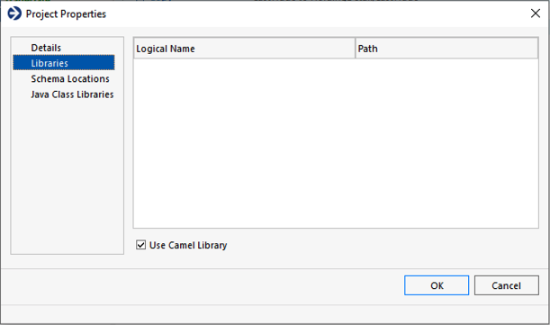
    
1. On the Services tab, right-click the pallet and select *New Exposed Service*.

    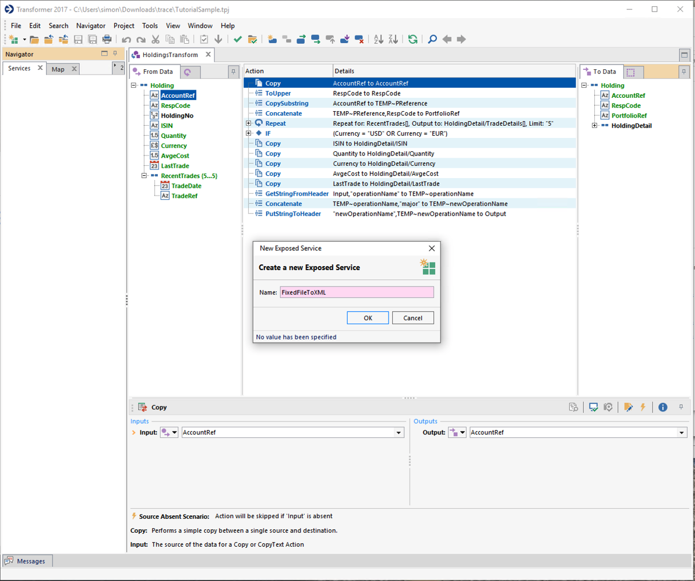
    
1. In the *New Exposed Service* window, select the *ProjectJarBuilder* and set *Java Language Level* to *8*.

    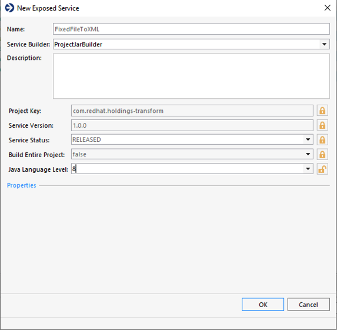
    
1. Right-click on the Exposed Service and select *New Exposed Service Operation*.  In the pop-up window, enter an *Operation Name* and select *OneToOneMapping* as the Service Performer.

    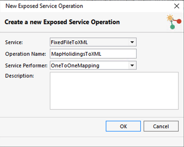

1. Select the *Definition Group* and *Mapping Definition*.  

    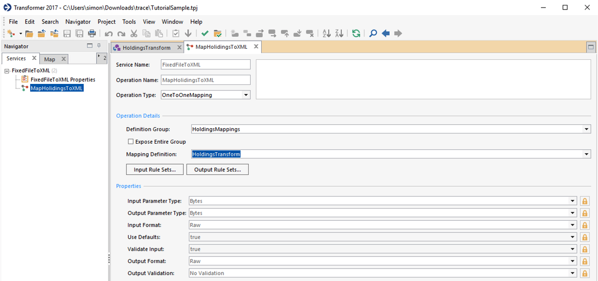
    
1. Right-click on the exposed operation, and select *Build Exposed Operation*

    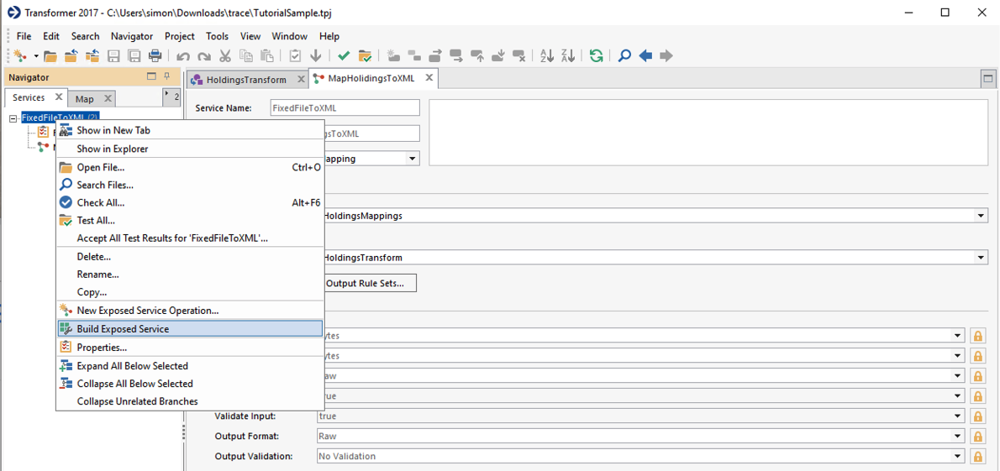
    
    
### Step 2: Install the Exposed Service to your local Maven repostiory


1. Once the exposed service is built, click on the file link and copy the generated file to your `/lib` directory in the `syndesis-extension-trace-transformer` project.

    

1. Via the command-line, install your Transformation Map to your local Maven repository:

```
mvn install:install-file -DgroupId=com.redhat -DartifactId=holdings-transform -Dversion=1.0.0 -Dfile=lib/holdings-transform-1.0.0.jar -Dpackaging=jar
```

### Step 3: Update your Transformer mapping service

Whenever you make a change to your Trace Transformer map, you need to re-generate the exposed service in Transformer, redeploy it to your local maven repository and re-import it into Syndesis.  The best way to do this is to update the following install script and run it:

```
./install.sh
```

Once you have updated the Maven repository, you can continue to generate the Syndesis extension


### Step 4: Generate the Syndesis extension

To create the step extension, compile the project using:

```
mvn clean package
```

### Step 5: Import the extension into Syndesis

1. Start your OpenShift cluster (or Minishift) and login to Syndesis

1. Click on *Customizations* menu, then the *Extensions* tab, then click **Import Extension**

    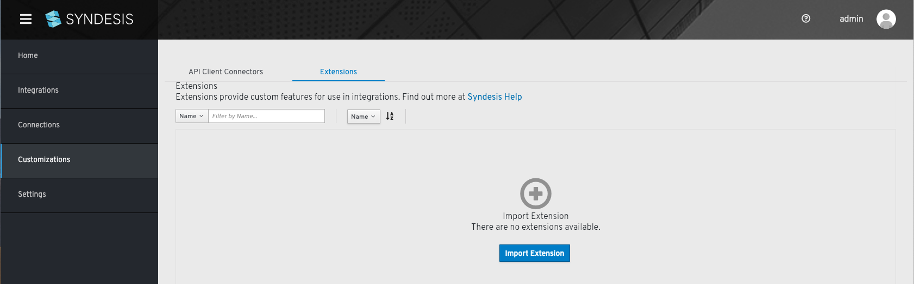
    
1. Select the `trace-transformer-extension-1.0.0.jar` in the `/target` directory

    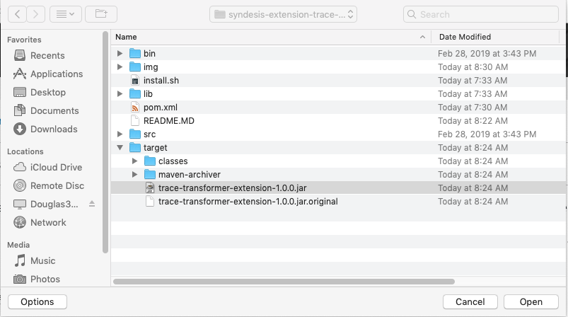
    
1. Click the *Import Extension* button.  The *Trace Transformer Extension* record should appear.

### Step 6: Build an integration

Build out at integration that tests your new extension.  The easiest flow is to consume a message from an AMQ broker, transform the message, then output it to the system log. It is assumed you have already pre-configured an AMQ broker *Connection* in syndesis.

1. Navigate to the *Integrations* menu, then click on the *Create Integration* button.

1. Select the *AMQ Broker* connection, and set the *Destination Name* and *Destination Type* to the queue that want to consume from.

    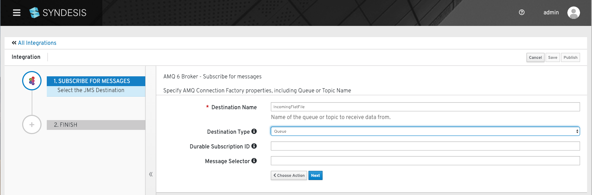
    
1. For the destination, select the *Simple Logger*, and then select **Log Body** and **Log Headers**.

    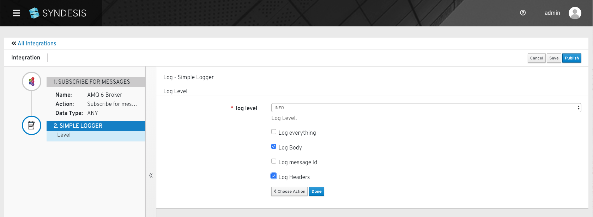
    
1. Add a step in between both Connections, then select the **Transform Body** extension that you just created.

    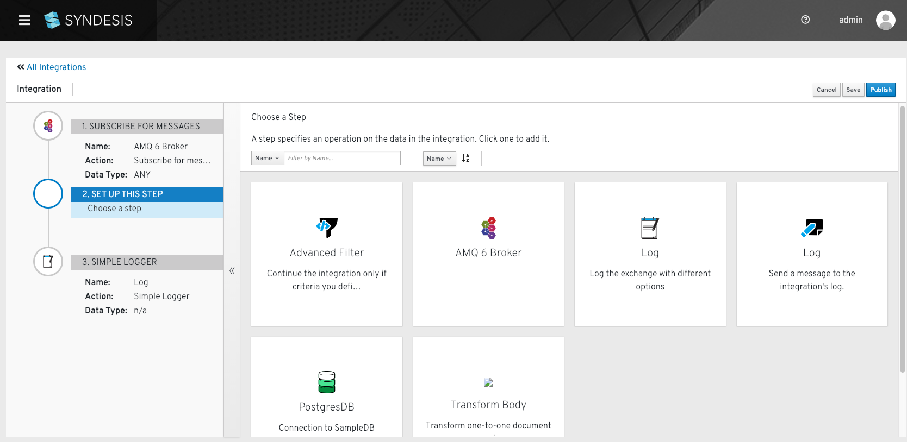

1.  Enter the *Project Key* value using the same project key from Step 1.1. Do the same for the *Operation Name* (found in Step 1.5).  Click **Done**.

    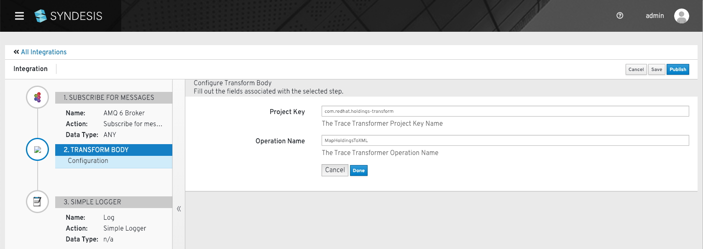

1. Click Publish, then give the Integration a name e.g. `Transform-Flatfile-to-XML.  Click **Publish**.

1. Once the integration has published and started-up correctly (check the logs), you can try sending a message via the AMQ broker screen.  The test file I use is:

	```bash
	ABGH1456900ABC001GB01849356841500.0000000    GBP4.5600000  2003123120030812ABC123456720030712ABB134287920030710ABA547968020030708ABA658748920030707AAB1346849
	```

1.  If the transformation was successful, you should see the following XML in the OpenShift log:

    ```bash
	{"exchange":"i-L_D8I5L2LXwUUep0Hydz","step":"null","id":"i-L_D8IYB2LXwUUep0Hyfz","message":"Exchange[ExchangePattern: InOnly, Headers: {breadcrumbId=i-L_D8I5L2LXwUUep0Hydz, JMSCorrelationID=null, JMSCorrelationIDAsBytes=null, JMSDeliveryMode=2, JMSDestination=queue://IncomingFlatFile, JMSExpiration=0, JMSMessageID=ID:broker-amq-1-hts64-40592-1551792493011-4:1:1:1:1, JMSPriority=0, JMSRedelivered=false, JMSReplyTo=null, JMSTimestamp=1551794254178, JMSType=null, JMSXGroupID=null, JMSXUserID=null, newOperationName=MapHoldingsToXMLmajor, operationName=MapHoldingsToXML, projectKey=com.redhat.holdings-transform, Syndesis.FLOW_ID=-L_D6lT2LjFFKh6ez2Eb, Syndesis.STEP_ID=-L_D6niSLjFFKh6ez2Eb, Syndesis.STEP_TRACKER_ID=i-L_D8IYB2LXwUUep0Hyfz, TraceTransformerMTypeConfig=MessageDefinitionGroups/Tutorial/Messages/Holding, TraceTransformerMTypeGroup=Tutorial, TraceTransformerMTypeKind=MSGD, TraceTransformerMTypeName=Holding, TraceTransformerOperationName=com.redhat.holdings-transform.MapHoldingsToXML}, BodyType: byte[], Body: <?xml version=\"1.0\"?><Holding xmlns=\"C:\\temp\\tutorial\\tutorial.xsd\" xmlns:xsi=\"http://www.w3.org/2001/XMLSchema-instance\">     <AccountRef>ABGH1456900</AccountRef>    <RespCode>ABC</RespCode>    <PortfolioRef>ABGH14/ABC</PortfolioRef>    <HoldingDetail>        <ISIN>GB0184935684</ISIN>        <Quantity>1500.0</Quantity>        <Currency>GBP</Currency>        <AvgeCost>4.56</AvgeCost>        <LastTrade>2003-12-31</LastTrade>        <TradeDetails>            <TradeDate>2003-08-12</TradeDate>            <TradeRef>ABC1234567</TradeRef>        </TradeDetails>        <TradeDetails>            <TradeDate>2003-07-12</TradeDate>            <TradeRef>ABB1342879</TradeRef>        </TradeDetails>        <TradeDetails>            <TradeDate>2003-07-10</TradeDate>            <TradeRef>ABA5479680</TradeRef>        </TradeDetails>        <TradeDetails>            <TradeDate>2003-07-08</TradeDate>            <TradeRef>ABA6587489</TradeRef>        </TradeDetails>        <TradeDetails>            <TradeDate>2003-07-0
	7</TradeDate>            <TradeRef>AAB1346849</TradeRef>        </TradeDetails>    </HoldingDetail></Holding>]"}
    ```

1.  Try modifying the AMQ message to force an error.  If you change the text, you should see an error message from Trace appear in the Syndesis Activity monitor.

    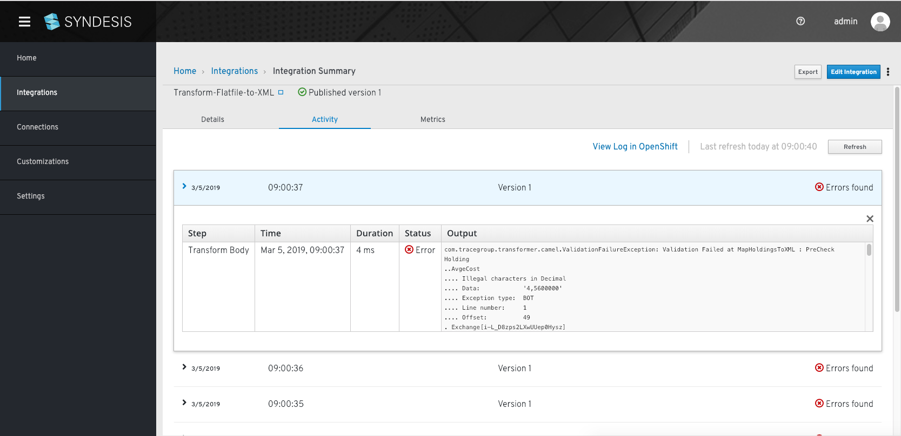

